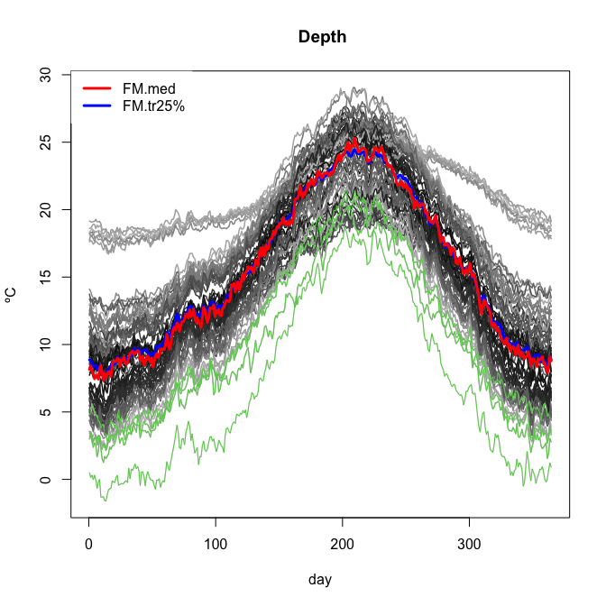

<!-- README.md is generated from README.Rmd. Please edit that file -->
rp.flm.test
===========

[](https://travis-ci.org/egarpor/rp.flm.test) [](https://www.gnu.org/licenses/gpl-3.0)

Overview
--------

Software companion for the paper *Goodness-of-fit tests for the functional linear model based on randomly projected empirical processes* (Cuesta-Albertos *et al.*, 2017). It implements the proposed tests and allows to replicate the empirical results presented.

Install
-------

``` r
# install.packages("devtools")
library(devtools)
install_github("egarpor/rp.flm.test")
```

Alternatively, see function `rp.flm.test` in the [`fda.usc`](http://cran.r-project.org/web/packages/fda.usc/) library (Febrero-Bande and Oviedo de la Fuente, 2012) for versions above `1.3.1`.

Usage
-----

### Simulated data

``` r
# Load package
library(rp.flm.test)

# Generate data
set.seed(345678)
t <- seq(0, 1, l = 101)
n <- 100
X <- r.ou(n = n, t = t, alpha = 2, sigma = 0.5)
beta0 <- fdata(mdata = cos(2 * pi * t) - (t - 0.5)^2, argvals = t,
               rangeval = c(0,1))
Y1 <- inprod.fdata(X, beta0) + rnorm(n, sd = 0.1)
Y2 <- log(norm.fdata(X)) + rnorm(n, sd = 0.1)

# Do not reject FLM
rp.test1 <- rp.flm.test(X.fdata = X, Y = Y1, verbose = FALSE)
rp.test1$p.values.fdr
#>     CvM    KS
#> 1 0.160 0.108
#> 2 0.226 0.212
#> 3 0.296 0.318

# Reject FLM
rp.test2 <- rp.flm.test(X.fdata = X, Y = Y2, verbose = FALSE)
rp.test2$p.values.fdr
#>   CvM KS
#> 1   0  0
#> 2   0  0
#> 3   0  0

# Estimations of beta
plot(beta0, main = "", ylab = expression(beta(t) * ", " * hat(beta)(t)))
lines(rp.test1$beta.est, col = 2)
lines(rp.test2$beta.est, col = 3)
```


``` r

# Simple hypothesis: do not reject beta = beta0
rp.flm.test(X.fdata = X, Y = Y1, beta0.fdata = beta0, 
            verbose = FALSE)$p.values.fdr
#>      CvM    KS
#> 1 0.3240 0.419
#> 2 0.3930 0.474
#> 3 0.5895 0.665

# Simple hypothesis: reject beta = beta0^2
rp.flm.test(X.fdata = X, Y = Y1, beta0.fdata = beta0^2, 
            verbose = FALSE)$p.values.fdr
#>   CvM    KS
#> 1   0 0.002
#> 2   0 0.004
#> 3   0 0.006

# Increasing n.proj
rp.flm.test(X.fdata = X, Y = Y1, n.proj = 3, verbose = FALSE)$p.values.fdr
#>     CvM    KS
#> 1 0.160 0.108
#> 2 0.226 0.212
#> 3 0.296 0.318
rp.flm.test(X.fdata = X, Y = Y1, n.proj = 5, verbose = FALSE)$p.values.fdr
#>     CvM    KS
#> 1 0.160 0.108
#> 2 0.226 0.212
#> 3 0.296 0.318
#> 4 0.152 0.036
#> 5 0.190 0.045

# Increasing B
rp.flm.test(X.fdata = X, Y = Y1, B = 1e3, verbose = FALSE)$p.values.fdr
#>     CvM    KS
#> 1 0.160 0.108
#> 2 0.226 0.212
#> 3 0.296 0.318
rp.flm.test(X.fdata = X, Y = Y1, B = 5e3, verbose = FALSE)$p.values.fdr
#>      CvM     KS
#> 1 0.1706 0.1142
#> 2 0.2388 0.2218
#> 3 0.2822 0.3327
```

### Tecator dataset

``` r
# Load package
library(rp.flm.test)

# Load data
data(tecator)
absorp <- tecator$absorp.fdata
ind <- 1:215 # sometimes ind <- 1:129 is considered as training dataset
x <- absorp[ind, ]
y <- tecator$y$Fat[ind]

# Composite hypothesis
rp.tecat <- rp.flm.test(X.fdata = x, Y = y, verbose = FALSE, B = 1e4)
rp.tecat$p.values.fdr
#>      CvM     KS
#> 1 0.0155 0.0153
#> 2 0.0171 0.0215
#> 3 0.0203 0.0216

# Simple hypothesis
zero <- fdata(mdata = rep(0, length(x$argvals)), argvals = x$argvals,
              rangeval = x$rangeval)
rp.flm.test(X.fdata = x, Y = y, beta0.fdata = zero, verbose = FALSE, B = 1e4)
#> 
#>  Random projection based test for the simple hypothesis in a
#>  functional linear model
#> 
#> data:  Y = <X, b> + e
#> Mean CvM = 22640.00, Mean KS = 266.02, p-value < 2.2e-16, p-value
#> < 2.2e-16, p-value < 2.2e-16, p-value < 2.2e-16, p-value <
#> 2.2e-16, p-value < 2.2e-16

# With derivatives
rp.tecat.1 <- rp.flm.test(X.fdata = fdata.deriv(x, 1), Y = y, verbose = FALSE,
                          B = 1e4)
rp.tecat.1$p.values.fdr
#>   CvM    KS
#> 1   0 9e-04
#> 2   0 0e+00
#> 3   0 0e+00
rp.tecat.2 <- rp.flm.test(X.fdata = fdata.deriv(x, 2), Y = y, verbose = FALSE,
                          B = 1e4)
rp.tecat.2$p.values.fdr
#>   CvM KS
#> 1   0  0
#> 2   0  0
#> 3   0  0
```

### AEMET dataset

``` r
# Load package
library(rp.flm.test)

# Load data
data(aemet)
wind.speed <- apply(aemet$wind.speed$data, 1, mean)
temp <- aemet$temp

# Remove the 5% of the curves with less depth (i.e. 4 curves)
par(mfrow = c(1, 1))
res.FM <- depth.FM(temp, draw = TRUE)
qu <- quantile(res.FM$dep, prob = 0.05)
l <- which(res.FM$dep <= qu)
lines(aemet$temp[l], col = 3)
```



``` r

# Data without outliers
wind.speed <- wind.speed[-l]
temp <- temp[-l]

# Composite hypothesis
rp.aemet <- rp.flm.test(X.fdata = temp, Y = wind.speed, verbose = FALSE, 
                        B = 1e4)
rp.aemet$p.values.fdr
#>      CvM     KS
#> 1 0.3960 0.3744
#> 2 0.6116 0.3961
#> 3 0.6116 0.3961

# Simple hypothesis
zero <- fdata(mdata = rep(0, length(temp$argvals)), argvals = temp$argvals,
              rangeval = temp$rangeval)
rp.flm.test(X.fdata = temp, Y = wind.speed, beta0.fdata = zero, verbose = FALSE,
            B = 1e4)
#> 
#>  Random projection based test for the simple hypothesis in a
#>  functional linear model
#> 
#> data:  Y = <X, b> + e
#> Mean CvM = 274.200, Mean KS = 29.106, p-value < 2.2e-16, p-value <
#> 2.2e-16, p-value < 2.2e-16, p-value < 2.2e-16, p-value < 2.2e-16,
#> p-value < 2.2e-16
```

Reproducibility of Cuesta-Albertos *et al.* (2017)
--------------------------------------------------

The directory [`/simulation`](https://github.com/egarpor/data-gofflm/tree/master/simulation) in the [data-gofflm](https://github.com/egarpor/data-gofflm) repository contains the scripts used in the simulation study of the aforementioned paper, as well as their `.RData` outputs. Those files are not downloaded when installing `rp.flm.test`.

References
----------

Cuesta-Albertos, J. A., García-Portugués, E., Febrero-Bande, M. and González-Manteiga, W. (2017). Goodness-of-fit tests for the functional linear model based on randomly projected empirical processes. *arXiv:1701.08363*. <https://arxiv.org/abs/1701.08363>

Febrero-Bande, M. and Oviedo de la Fuente, M. (2012). Statistical Computing in Functional Data Analysis: The R Package fda.usc. *Journal of Statistical Software*, 51(4), 1-28. <http://www.jstatsoft.org/v51/i04/>
